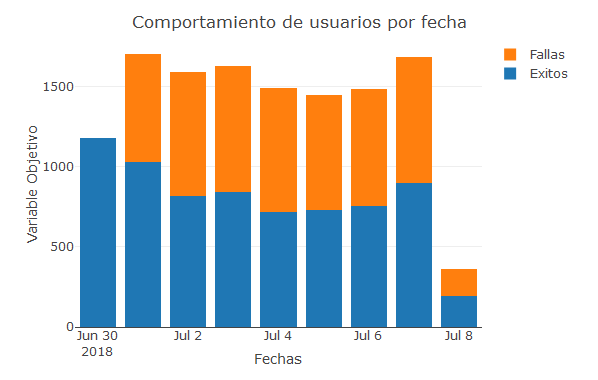
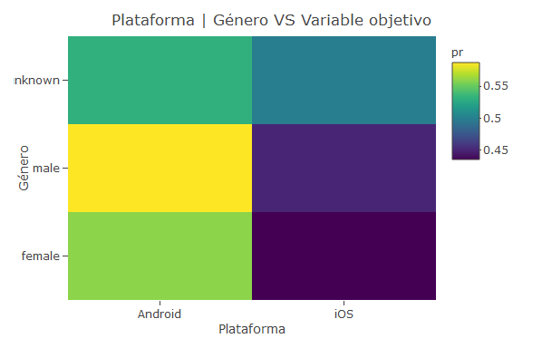
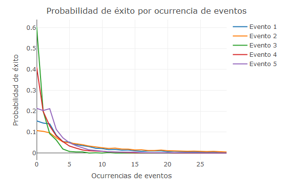
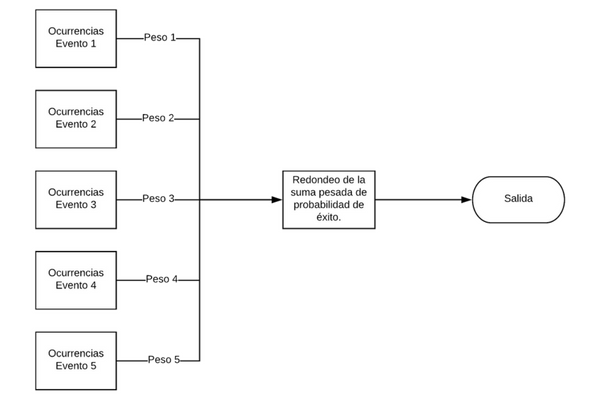
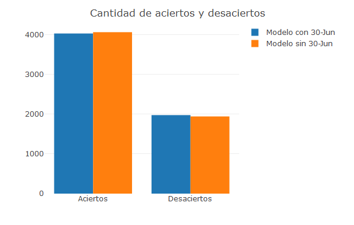

# Resumen

Se quiere generar un modelo capaz de determinar si un usuario que ha instalado una determinada aplicación en un determinado día volverá a usar la aplicación al día siguiente, para esto se tiene un conjunto de datos con información relevante por medio de un archivo csv. 

# Exploración de datos

## Descripción de los datos

El conjunto de datos a estudiar consta de 20000 registros cada uno con información sobre:
    
* user_id: Identificación de usuario.

* install_time: Fecha y hora de la instalación.

* platform: Sistema operativo del dispositivo (Android o iOS).

* country_region: Provincia.

* city: Ciudad.

* gender: Género del usuario (Hombre o Mujer).

* min_age_range: Mínima edad probable del usuario.

* max_age_range: Máxima edad probable del usuario.

* event_1: Número de ocurrencias del evento 1.

* event_2: Número de ocurrencias del evento 2.

* event_3: Número de ocurrencias del evento 3.

* event_4: Número de ocurrencias del evento 4.

* event_5: Número de ocurrencias del evento 5.

* target_churn_indicator: Variable objetivo (vale 1 si el usuario jugó al siguiente día, 0 sino).

## Separación del conjunto

En una primera instancia, se dividieron los datos en dos conjuntos, uno, con el 70% de los datos para ser usado como entrenamiento, y otro, con el 30% restante para ser usado de prueba, la selección se realizó aleatoriamente, fijando una semilla para hacer posible el reprocesamiento.

|  .  | Entrenamiento | Prueba |
|----|---------------|--------|
| Número de registros | 14000 | 6000 |
Tabla.1 - Número de datos por conjunto.

## Validación

Antes de realizar cualquier análisis primero se hizo una revisión de los datos, la validación consiste en:
    
1. Verificar que no se tenga duplicidad de los id's

2. Verificar que la cota mínima de edad de un usuario sea menor o igual a la cota superior.

3. Búsqueda de cualquier otra anomalia.

#### Verificación de user id's

Luego de realizado un conteo de registros por cada id se consiguieron un total de 711 con más de un registro.

Debido a que los registros con un mismo ID no coincidian, es decir, no eran registros repetidos (Contenian valores diferentes para las mismas variables), se decidió eliminar estos registros con la finalidad de mantener la integridad de los datos. 

| Número de registros | Cantidad de ID's |
|---------------------|------------------|
|  1 | 12576 |
|  2 | 709 |
|  3 | 2 |
Tabla.2 - Cantidad de ID's según total de registros observados.

#### Verificación de rango de edad

Se encontraron un total de 8 registros en los cuales la cota inferior del rango de edad era mayor a la cota superior. Debido a que no se pueda asegurar la integridad del resto de los datos para estos registros se decidió eliminar dichos registros. 

#### Búsqueda de otras anomalias. 

La totalidad de los registros realizados el dìa 30-06-2018, el cual coincide con ser el primer dìa en la muestra, son casos de éxito (El usuario uso la aplicación al dìa siguiente de la instalación), lo cual no coincide con el resto de los dìas, debido a que se desconoce si es un fenómeno real o no, se decidió duplicar el set de entrenamiento, manteniento en uno estos datos y eliminándolos en el otro.

------

## Análisis exploratorio

En una primera instancia se estudió el comportamiento de los predictores contra la variable objetivo, observando principalmente la correlación entre estas, de este análisis se determinó que las variables que mayor correlación poseen con la variable a predecir son los contadores de eventos (events_1, events_2, etc.), no se logró encontrar una relación importante entre el resto de los predictores y la variable objetivo. 

-------

------

| Variable | Correlación | 
|----------|-------------|
| Platform | -0.0385 |
| Gender | 0.0244 |
| Min_age_range | -0.0363 |
| Max_age_range | -0.0363 |
| Event 1 | -0.3408 |
| Event 2 | -0.2847 |
| Event 3 | -0.2629 |
| Event 4 | -0.3944 |
| Event 5 | -0.2512 |
Tabla.3 - Cálculo de correlaciones.

# Modelado

## Descripción del modelo

El modelo propuesto se trata de una red bayesiana la cual utiliza la probabilidad marginal de éxito condicionada a las ocurrencias de un determinado evento para luego generar la función de densidad de probabilidad de éxito. 

El proceso de entrenamiento del modelo consta de:

1. Calcular la probabilidad de éxito para cada uno de los posibles niveles de ocurrencia de un determinado evento. (Esto se hace por separado para cada uno de los 5 eventos).

2. Cálculo de las correlaciones entre el número de ocurrencias de cada uno de los eventos y la variable a predecir, esta correlación es normalizada y luego transformada para que, la suma de las mismas sea 1 y mantengan las relaciones entre sí.

La aplicación del modelo a nuevos datos se resume en:

1. Obtener el número de ocurrencias de cada uno de los eventos medidos. 

2. Calcular la probabilidad de éxito.

3. Si P(Exito) > 0.5 Entonces predecimos que el usuario usará la aplicación el siguiente día. 

## Prueba del modelo

Para calcular la eficiencia del modelo se tomó en cuenta la cantidad de aciertos sobre los 6000 datos reservados para las pruebas. Adicionalmente se realizó una medición del tiempo de entrenamiento y de estimación en orden de tomar en cuenta la aplicabilidad del modelo. 

Se debe recordar que se harán pruebas para el mismo modelo entrenado con dos conjuntos de datos, el primero contiene los datos del 2018-07-30, mientras que el segundo no.

| Estadístico | Modelo con 30-Jun | Modelo sin 30-Jun |
|-------------|-------------------|-------------------|
| P(Exito) | 0.671 | 0.6765 |
| Tiempo de entrenamiento | 1.2585 S | 0.9873 S |
| Datos de entrenamiento | 12576 | 11121 S |
| Promedio tiempo estimación | 0.00002 S | 0.0002 S |

En conclusión el modelo presentado tiene un procentaje de acierto de 67.1% aproximadamente. Este podría elevarse aplicando un método de optimización sobre las variables de peso.  Adicionalmente se presentaron tiempos de entrenamiento y estimación bajos lo cual hace al modelo factible de implementar. 

